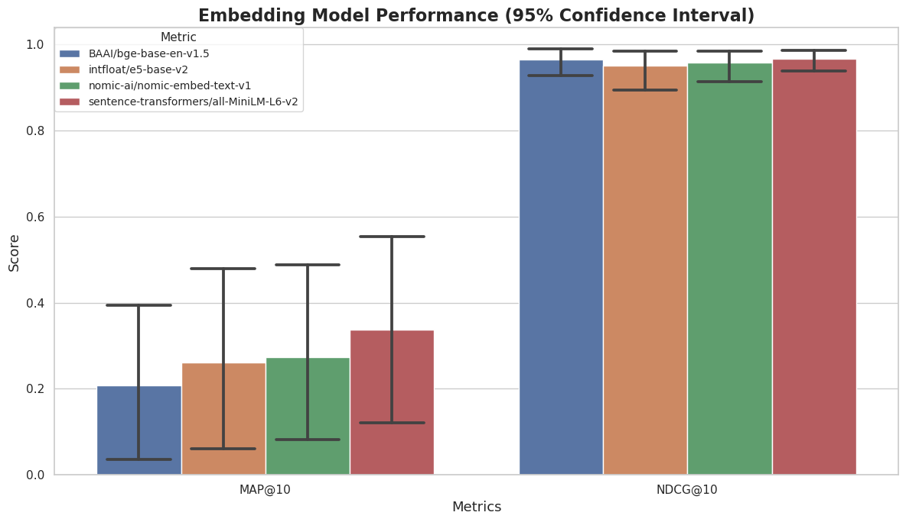
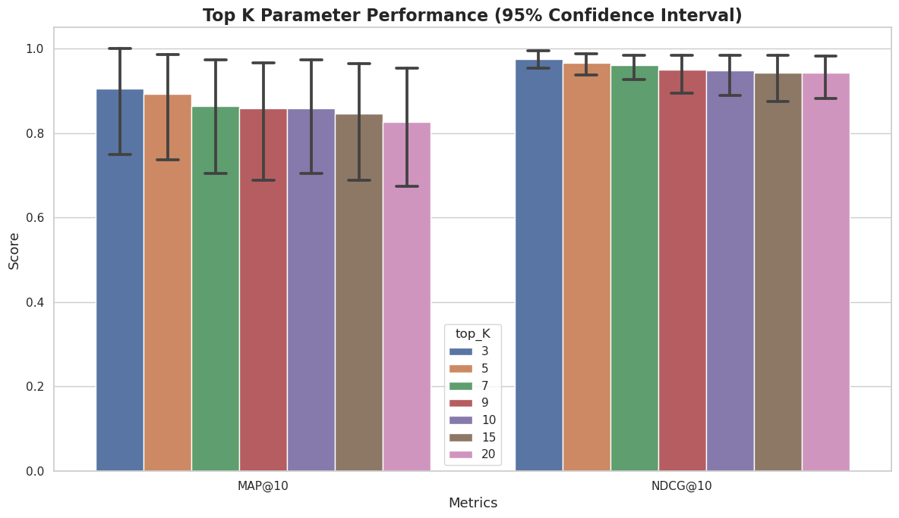
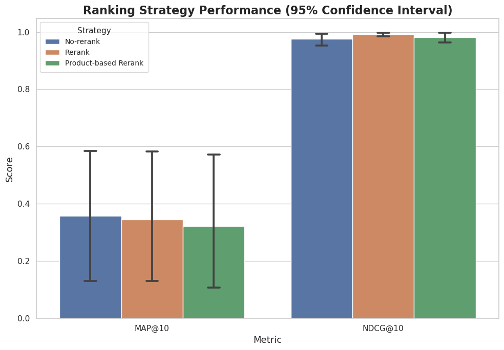
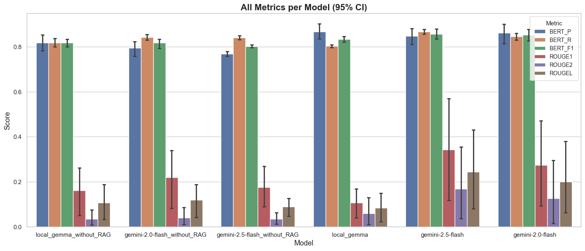
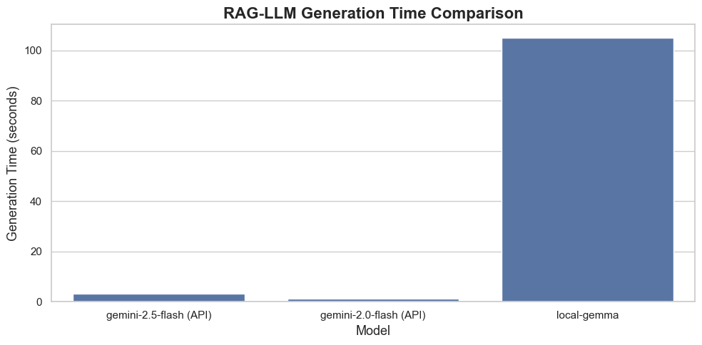

# Scalable RAG System for Henkel Adhesive Products

A Retrieval-Augmented Generation (RAG) system that answers technical questions about Henkel LOCTITE adhesive products by retrieving information from Safety Data Sheets (SDS) and generating answers with LLMs.

## Overview

This project builds an end-to-end RAG pipeline over 36 Henkel LOCTITE product PDFs. The system:

1. **Parses and chunks** PDF safety data sheets using `unstructured`, with text cleaning and section-aware chunking.
2. **Embeds** text chunks using sentence transformer models and stores them in a FAISS vector index for fast similarity search.
3. **Retrieves** relevant chunks at query time using FAISS cosine similarity, with optional cross-encoder reranking and product-scoped search.
4. **Generates** answers by augmenting an LLM prompt with retrieved context — supports both Google Gemma model and the Google Gemini API.
5. **Serves** the pipeline through a FastAPI backend and a Streamlit chat UI.

## Installation

```bash
# Clone the repository
git clone https://github.com/TracyWu7724/Scalable_LLM.git && cd Scalable_LLM

# Install dependencies
pip install -r requirements.txt

# Set your Gemini API key (required for the API-based RAG backend)
echo "GEMINI_API_KEY=<your-key>" > .env
```

## Usage

### Run locally

```bash
# Start the FastAPI backend (port 8000) and Streamlit UI (port 8501)
bash run.sh
```

Then open `http://localhost:8501` in your browser, select an embedding model, and start asking questions.

### Run with Docker

```bash
docker build -t henkel-rag .
docker run -p 8000:8000 -p 8501:8501 --env-file .env henkel-rag
```

### Rebuild embeddings from PDFs (optional)

```python
from data_preprocessing import DataPreprocessor, EmbedProcess

# Step 1: Parse PDFs into a JSONL corpus
preprocessor = DataPreprocessor(input_dir="Data", output_path="corpus.jsonl")
preprocessor.save_corpus()

# Step 2: Generate embeddings and FAISS index
data = EmbedProcess.from_corpus("corpus.jsonl", embed_model_name="BAAI/bge-base-en-v1.5")
data.save_embeddings(output_dir="embeddings")
```

## Evaluation

### Retrieval: Embedding Model Comparison

MAP@10 and NDCG@10 across four embedding models using global FAISS retrieval.



### Retrieval: Top-K Parameter Sensitivity

Effect of varying the top-K retrieval parameter on MAP@10 and NDCG@10.



### Retrieval: Ranking Strategy Comparison

Comparison of no-rerank, global rerank, and product-based rerank strategies.



### Generation: Model Performance (with and without RAG)

BERTScore and ROUGE metrics across local Gemma and Gemini API models, with and without RAG context.



### Generation: Strategy Comparison

BERTScore and ROUGE across baseline, global rerank, and product-based rerank strategies for Gemini models.


### End-to-End Latency

Generation time comparison between Gemini API and local Gemma model.




## Future TODO
* support multi-turn conversation by storing previous chat history and query rewriting
* add distributed system setting by managing background work queue, multi-instance API and load balancer
* explore cheaper option of AWS EC2
* add more user-friendly UI via TypeScript in React


